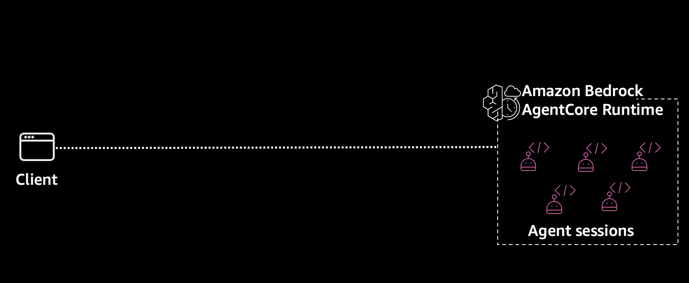
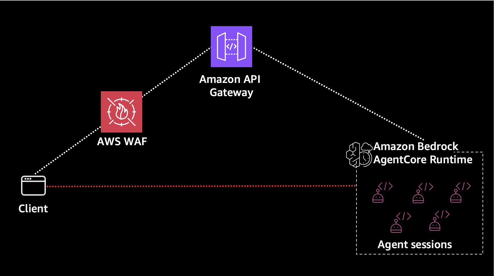
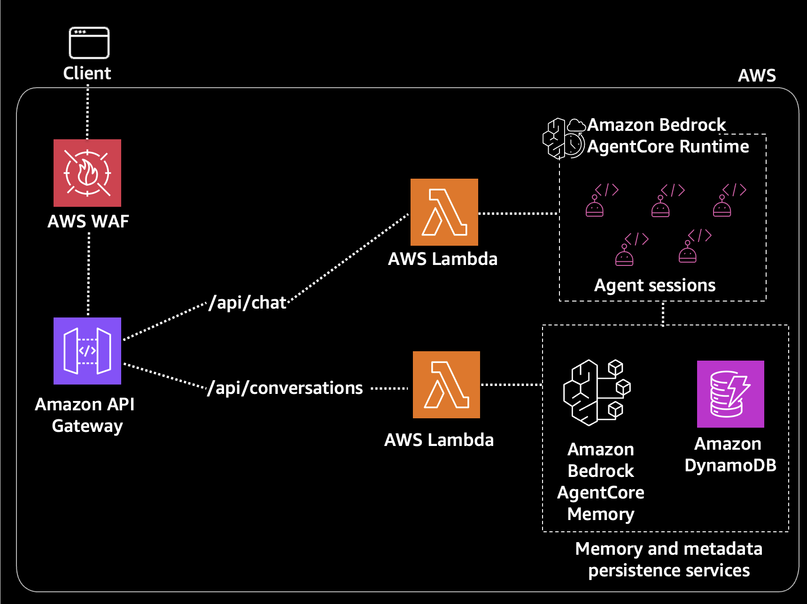

## Overview

This repository contains different architectural patterns for deploying AI agents on AWS using Amazon Bedrock AgentCore Runtime. Each iteration builds on the previous, showing a progression from simple to production-ready.

All agents included are simple prototypes using LangGraph but could be extended for different use cases. The focus of this is the surrounding architectural components, not the agent functionality itself.

## How to Use This Repository

This repository is designed to be walked through sequentially, starting with the simplest (but least secure) pattern and progressively adding layers of security and functionality.

**Recommended approach:**

1. **Start with Iteration 0** to understand the basics of Amazon Bedrock AgentCore and Amazon Cognito OAuth authentication. This is the quickest way to get an agent running, but exposes the agent directly to the browser.



2. **Move to Iteration 1** to add Amazon API Gateway in front of the agent. This adds rate limiting via AWS WAF, but has a security gap: users get a JWT that works for both the API and the agent directly.




3. **Progress to Iteration 2** to fix the security gap by switching to IAM authentication. Now users authenticate to Amazon API Gateway with Amazon Cognito, but the AWS Lambda calls the agent using IAM credentials. Users can no longer bypass your API.


4. **Finish with Iteration 3** to add conversation persistence using Amazon Bedrock AgentCore Memory and Amazon DynamoDB for a full-featured chat experience.




You can also jump directly to any iteration if you already understand the tradeoffs, or use a specific iteration as a starting point for your own project.

> **Note**: The Amazon Cognito stack deployed in Iteration 0 is shared across all iterations, so you only need to deploy it once.

## Iterations

### Iteration 0: Direct Browser to Amazon Bedrock AgentCore

**Best for**: Quick prototypes and understanding the basics.

```
Browser → Amazon Bedrock AgentCore Runtime (OAuth via Amazon Cognito)
```

- Simplest possible setup
- Browser calls Amazon Bedrock AgentCore directly
- Amazon Cognito OAuth for authentication

[View Iteration 0 →](./iteration-0/)

### Iteration 1: Amazon API Gateway + Amazon Bedrock AgentCore

**Best for**: Adding API management without custom compute.

```
Browser → Amazon API Gateway → Amazon Bedrock AgentCore Runtime (OAuth)
              (Amazon Cognito)
```

- Amazon API Gateway handles rate limiting, request validation
- Amazon Cognito authorizer on Amazon API Gateway
- OAuth JWT pass-through to Amazon Bedrock AgentCore
- **Security note**: User JWT works for both API and agent - not ideal for production

[View Iteration 1 →](./iteration-1/)

### Iteration 2: Amazon API Gateway + AWS Lambda + Amazon Bedrock AgentCore (IAM Auth)

**Best for**: Secure production setup with custom compute layer.

```
Browser → Amazon API Gateway → AWS Lambda → Amazon Bedrock AgentCore Runtime (IAM Auth)
              (Amazon Cognito)
```

- AWS Lambda layer for custom logic, logging, input validation
- Agent uses IAM auth - users can't bypass API to call agent directly
- Amazon Cognito validation at Amazon API Gateway level only
- Fixes the security gap in Iteration 1

[View Iteration 2 →](./iteration-2/)

### Iteration 3: Amazon API Gateway + AWS Lambda + Amazon Bedrock AgentCore with Memory

**Best for**: Full-featured chat with conversation persistence.

```
Browser → Amazon API Gateway → AWS Lambda (Chat) → Amazon Bedrock AgentCore Runtime + Memory
                            → AWS Lambda (Conversations) → Amazon Bedrock AgentCore Memory + Amazon DynamoDB
```

- Separate AWS Lambda functions for chat and conversation history
- Amazon Bedrock AgentCore Memory for conversation persistence
- Amazon DynamoDB for conversation metadata (names)
- Auto-generated conversation names

[View Iteration 3 →](./iteration-3/)

## Prerequisites

- AWS CLI configured with credentials (`aws configure`)
- AWS SAM CLI installed ([installation guide](https://docs.aws.amazon.com/serverless-application-model/latest/developerguide/install-sam-cli.html))
- Python 3.11+ (`python3 --version` to check)
- AgentCore CLI (`pip install bedrock-agentcore-starter-toolkit`)
- `uv` installed ([installation guide](https://docs.astral.sh/uv/getting-started/installation/)) and the `zip` CLI available - both are required for Direct Code Deploy
- Bedrock model access enabled in your AWS account (Claude models)

> **Tip**: Run `aws sts get-caller-identity` to verify your AWS credentials are working before starting.

> **Windows users**: The `zip` CLI doesn't ship with Windows (install it with `choco install zip` or `scoop install zip`, or use WSL). If `uv` or `zip` is missing, `agentcore configure` prints a brief warning and silently falls back to **container deployment**, which requires ECR permissions that the execution roles in this repo don't include - your deploy will then fail with an ECR validation error. Install both tools before configuring any agent.

## Getting Started

**Start with Iteration 0** - it includes the Cognito stack that's shared across all iterations:

```bash
cd iteration-0

# Deploy Cognito (used by all iterations)
aws cloudformation deploy \
  --template-file cognito.yaml \
  --stack-name agentcore-cognito \
  --capabilities CAPABILITY_NAMED_IAM \
  --region us-east-1
```

> **Note**: Wait for the stack to complete before proceeding. You can check status with:
> ```bash
> aws cloudformation describe-stacks --stack-name agentcore-cognito --query 'Stacks[0].StackStatus'
> ```

```bash
# Create a test user
USER_POOL_ID=$(aws cloudformation describe-stacks \
  --stack-name agentcore-cognito \
  --query 'Stacks[0].Outputs[?OutputKey==`UserPoolId`].OutputValue' \
  --output text)

aws cognito-idp admin-create-user \
  --user-pool-id $USER_POOL_ID \
  --username <YOUR_USERNAME_HERE> \
  --temporary-password <YOUR_PASSWORD_HERE> \
  --message-action SUPPRESS

aws cognito-idp admin-set-user-password \
  --user-pool-id $USER_POOL_ID \
  --username <YOUR_USERNAME_HERE> \
  --password <YOUR_PASSWORD_HERE> \
  --permanent
```

> **Password Requirements**: Must be 8+ characters with uppercase, lowercase, numbers, and special characters

Then follow the README in each iteration folder.

## Repository Structure

```
.
├── iteration-0/        # Direct browser to Amazon Bedrock AgentCore
├── iteration-1/        # Amazon API Gateway + Amazon Bedrock AgentCore (OAuth)
├── iteration-2/        # Amazon API Gateway + AWS Lambda + Amazon Bedrock AgentCore (IAM)
└── iteration-3/        # AWS Lambda + Amazon Bedrock AgentCore with Memory
```

## Security
See CONTRIBUTING for more information.

## License
This library is licensed under the MIT-0 License. See the LICENSE file.
