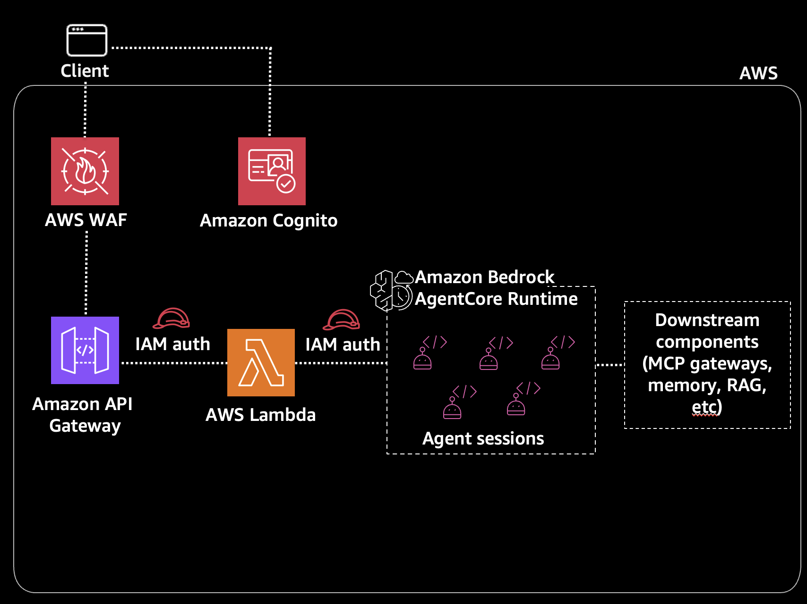

# Iteration 2: Amazon API Gateway → AWS Lambda → Amazon Bedrock AgentCore (IAM Auth)

This iteration adds a thin AWS Lambda layer between Amazon API Gateway and Amazon Bedrock AgentCore Runtime.
The AWS Lambda uses IAM to call the agent - users can't bypass the API layer.

## Architecture




## What is different with this iteration?

Iteration 1 has a subtle security gap: the user gets a JWT that works for both the Amazon API Gateway AND the agent runtime directly. A malicious user could bypass your API and call the agent directly if the actor somehow knew the agent endpoint.

Iteration 2 fixes this by:
- **AWS Lambda Layer**: Adds compute for request processing, logging, and future extensibility
- **IAM Auth on Agent**: Agent uses IAM instead of OAuth - users can't call it directly
- **Amazon Cognito on Amazon API Gateway**: JWT validation happens at the Amazon API Gateway level only

## Prerequisites

**Amazon Cognito and IAM role must be deployed first** (from iteration-0):

```bash
cd ../iteration-0
aws cloudformation deploy \
  --template-file cognito.yaml \
  --stack-name agentcore-cognito \
  --capabilities CAPABILITY_NAMED_IAM \
  --region us-east-1
```

> **Note**: If you already deployed Amazon Cognito for a previous iteration, skip this step.

Get the execution role ARN:
```bash
EXECUTION_ROLE_ARN=$(aws cloudformation describe-stacks \
  --stack-name agentcore-cognito \
  --query 'Stacks[0].Outputs[?OutputKey==`AgentCoreExecutionRoleArn`].OutputValue' \
  --output text)
echo "Execution Role ARN: $EXECUTION_ROLE_ARN"
```

> **Save this ARN** - you'll need it when configuring the agent.

Also need:
- AWS SAM CLI installed ([installation guide](https://docs.aws.amazon.com/serverless-application-model/latest/developerguide/install-sam-cli.html))
- Test user created (see iteration-0 README)

## Project Structure

```
iteration-2/
├── README.md
├── template.yaml            # AWS SAM template
├── samconfig.toml
├── agent/
│   ├── agent.py             # LangGraph agent (IAM auth)
│   └── requirements.txt
├── lambda/
│   ├── app.py               # AWS Lambda handler
│   └── requirements.txt
└── frontend/
    └── index.html           # Single-page chat UI
```

## Deployment

### 1. Deploy Agent with IAM Auth

```bash
cd agent
agentcore configure
```

When prompted during configuration:
- **Entrypoint**: `agent.py`
- **Agent name**: `agent_2` (or press Enter for default)
- **Requirements file**: Press Enter to use detected `requirements.txt`
- **Deployment type**: `1` (Direct Code Deploy)
- **Python runtime**: `2` (PYTHON_3_11)
- **Execution role**: Paste the `$EXECUTION_ROLE_ARN` from prerequisites
- **S3 bucket**: Press Enter to auto-create
- **Configure OAuth authorizer?**: `no` (we use IAM auth for iteration-2)
- **Request header allowlist**: `no`
- **Memory**: `s` (skip - no memory for iteration-2)

> **Important**: Iteration-2 uses IAM authentication (not OAuth). The AWS Lambda calls the agent using its IAM role, so users can't bypass the API to call the agent directly.

Then deploy:
```bash
agentcore deploy
```

Note the Agent ARN from the output.

### 2. Get Amazon Cognito ARN

```bash
COGNITO_ARN=$(aws cloudformation describe-stacks \
  --stack-name agentcore-cognito \
  --query 'Stacks[0].Outputs[?OutputKey==`UserPoolArn`].OutputValue' \
  --output text)
echo "Cognito ARN: $COGNITO_ARN"
```

### 3. Deploy AWS Lambda + Amazon API Gateway

From the iteration-2 directory:

```bash
cd ..  # Back to iteration-2 root (if still in agent/)

# Build and deploy
sam build
sam deploy --parameter-overrides \
  "AgentCoreRuntimeArn=arn:aws:bedrock-agentcore:<YOUR_REGION>:<YOUR_ACCOUNT_ID>:runtime/<YOUR_AGENT_RUNTIME_ID>" \
  "CognitoUserPoolArn=arn:aws:cognito-idp:<YOUR_REGION>:<YOUR_ACCOUNT_ID>:userpool/<YOUR_USER_POOL_ID>"
```

> **Tip**: Copy the full Agent ARN directly from the `agentcore deploy` output to avoid typos.

> **If deployment fails with ROLLBACK_COMPLETE**: The stack is in a failed state. Delete it first:
> ```bash
> aws cloudformation delete-stack --stack-name iteration2
> # Wait for deletion, then retry sam deploy
> ```

Get the Amazon API Gateway endpoint from the outputs:
```bash
API_ENDPOINT=$(aws cloudformation describe-stacks \
  --stack-name iteration2 \
  --query 'Stacks[0].Outputs[?OutputKey==`ApiEndpoint`].OutputValue' \
  --output text)
echo "API Endpoint: $API_ENDPOINT"
```

### 4. Update Frontend Config

Edit `frontend/index.html` and update the CONFIG section with your values.

> **Quick way to get all values**:
> ```bash
> # Cognito domain (remove https:// prefix when using)
> aws cloudformation describe-stacks --stack-name agentcore-cognito \
>   --query 'Stacks[0].Outputs[?OutputKey==`CognitoDomain`].OutputValue' --output text
> 
> # Client ID
> aws cloudformation describe-stacks --stack-name agentcore-cognito \
>   --query 'Stacks[0].Outputs[?OutputKey==`UserPoolClientId`].OutputValue' --output text
> 
> # API Endpoint
> aws cloudformation describe-stacks --stack-name iteration2 \
>   --query 'Stacks[0].Outputs[?OutputKey==`ApiEndpoint`].OutputValue' --output text
> ```

### 5. Test

```bash
cd frontend
python3 -m http.server 8000
```

Open http://localhost:8000 and login with `<YOUR_USERNAME_HERE>` / `<YOUR_PASSWORD_HERE>`

> **Troubleshooting**:
> - **500 Internal Server Error**: Check AWS Lambda logs in Amazon CloudWatch. Common cause is missing IAM permissions.
> - **401 Unauthorized**: Token expired. Log out and back in.

## Cleanup

```bash
sam delete --stack-name iteration2
cd agent && agentcore destroy
```
